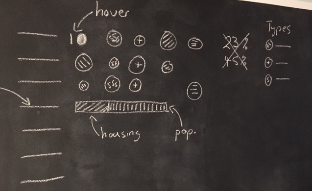
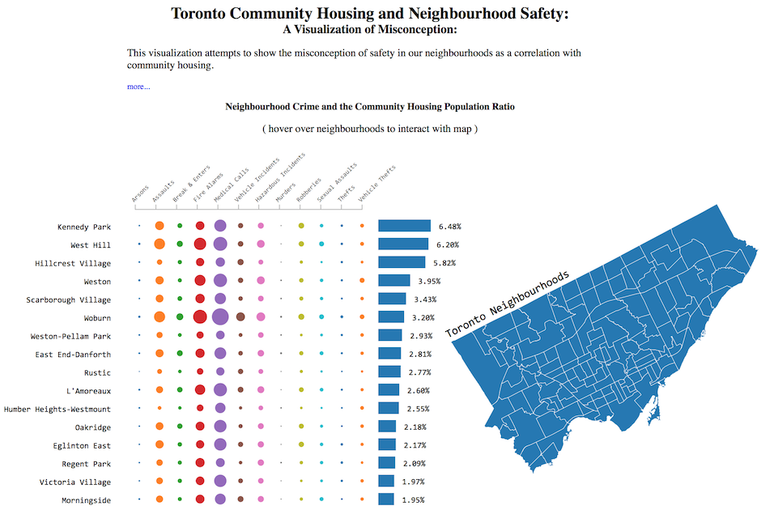

# Summary
This visualization shows the misconception of safety in Toronto neighbourhoods as a correlation with community housing. The 20 top community housing neighborhoods, ranked by population ratio, are not leaders in neighbourhood crimes. That is, there is no obvious relationship between the type or rate of crime in a neighbourhood and that of the neighbourhood's community housing population ratio.

# Design
**Representing the data**

One of the more dificult design choices was determining how to represent the 3 types of related data in one chart. Similiar to a bubble chart, however, the number of neighbourhoods (140) prevented this typical x,y layout. I reviewed many other options online and found a visualization that would suit my data appropriately - [Journals Visualization by Asif Rahman](http://neuralengr.com/asifr/journals/)

**Interactive for clarity**

Another design choice was adding an interactive map of the neighbourhoods. This map was added, based on some initial feedback, to create more of a visual representation for where these neighbourhoods are in relation to eachother. Also, to facilitate location of each neighbourhood on the map I added the hover and highlight affect, i.e. when you hover over the neighbourhood name, the neighbourhood is highlighted on the map.

# Feedback
**Udacity forum**
> Some of the bubbles are so small, that it is hard to discern, how different each neighborhood is. e.g. Thefts. It would better to increase the size of the bubbles, so the comparison is easy

*Change: A hover effect was added for each neighbourhood label that will show the actual number/value of the bubbles. Changing the scale representing the bubbles caused some issues with large outlyers causing all large values to seem to be same size (a reverse of the issue) but also caused the chart itself to require more space or have the bubbles overlap.*

**Friend**
> It would be great to see exactly where these neightbourhoods are on a real map

*Change: A shapefile of the neightbourhood was downloaded, transformed and manipulated into a D3 Topo.JSON file and added as an interactive map representing the neighbourhoods - [Topo, Geo JSON and Shapefile](https://github.com/jasonicarter/toronto-geojson)*

**Friend**
> I'd like to see not just the top 10 neighbourhoods with community housing but what about the top murder neightbourhoods or assualts?

*Unable to get this feature working properly. Sorting the data and providing group radio buttons for the user to select was completed; however, once data was updated in the chart the previous data re-adjust their positions causing overlaps. More time would be required to implement feature.*

# Initial Sketch and Final Version
Below are embedded or links to both sketches and final versions of the visualization

**Initial**

The initial chart was similiar to the final version except missing a few details concerning the best way to indicate the crime types/labels, community housing population and actual crime numbers. Also, there was no neighbourhood map.

**Final**

The final visualization incorporates an interactive chart and map. Hovering over the neighbourhood names on the chart will display the actual crime numbers (instead of the circles) and also highlight the neighbourhoods position on the map.

# Resources
Below are a list of websites and ebooks that helped me along the way...

* [Namara.io Toronto Neighbourhood Crime](https://namara.io/#/data_sets/b668078d-7fb2-4ab0-9c7b-7c39f744b63c)
* [Toronto Open Data - Neighbourhoods](http://www1.toronto.ca/wps/portal/contentonly?vgnextoid=04b489fe9c18b210VgnVCM1000003dd60f89RCRD&vgnextchannel=75d6e03bb8d1e310VgnVCM10000071d60f89RCRD)
* [Bl.ocks](http://bl.ocks.org/)
* [Journals Visualization by Asif Rahman](http://neuralengr.com/asifr/journals/)
* [Mike Bostock - Let's Make a Bar Chart](https://bost.ocks.org/mike/bar/)
* [Interactive Data Visualization - Scott Murray](http://alignedleft.com/tutorials/d3)
